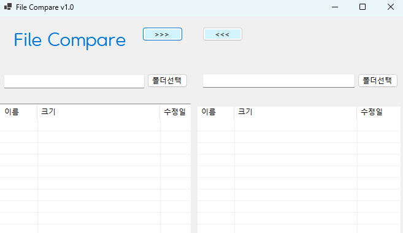

# [C# 코딩] 파일 비교 툴
## 개요
- C# 프로그래밍 학습
- 1줄 소개 : 두 폴더의 파일들을 비교하여 상호 복사하는 툴.
- 사용한 플랫폼 : C#, .NET Windows Forms, Visual Studio, Github.
- 사용한 컨트롤: 
- 사용한 기술과 구현한 기능 :

## 실행 화면 (과제1)
- 과제1 코드의 실행 스크린 샷

- 과제 내용
	- 컨트롤 배치와 기본적인 속성 설정
	- 컨트롤 이름 정하기

- 구현 내용과 기능 설명
	- 기본 UI 배치 및 기능을 구현하였습니다.
	- GUI설계, 컨트롤 배치를 완료하였습니다.
	- 컨트롤에서 기본적으로 제공하는 기능에 대해 구동 확인하였습니다.