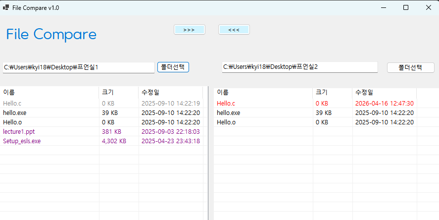
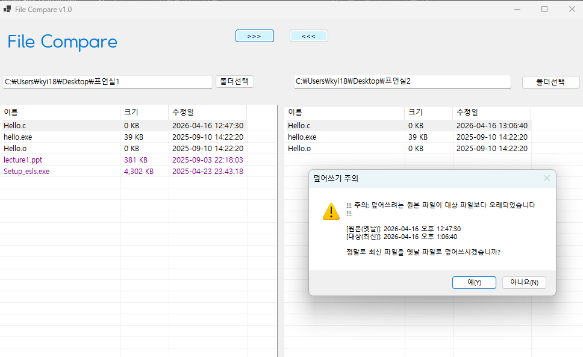

# [C# 코딩] 파일 비교 툴
## 개요
- C# 프로그래밍 학습
- 1줄 소개 : 두 폴더의 파일들을 비교하여 상호 복사하는 툴.
- 사용한 플랫폼 : C#, .NET Windows Forms, Visual Studio, Github.
- 사용한 컨트롤: label, textbox, button, listbox,spliconter, folderbrowserdialog, messagebox.등.
	- 사용한 기술과 구현한 기능 : 폴더 선택, 파일 리스트 표시, 파일 비교, 파일 복사, 메시지 박스 등.

## 실행 화면 (과제1)
- 과제1 코드의 실행 스크린 샷

- 과제 내용
	- 컨트롤 배치와 기본적인 속성 설정
	- 컨트롤 이름 정하기

- 구현 내용과 기능 설명
	- 기본 UI 배치 및 기능을 구현하였습니다.
	- GUI설계, 컨트롤 배치를 완료하였습니다.
	- 컨트롤에서 기본적으로 제공하는 기능에 대해 구동 확인하였습니다.

## 실행 화면 (과제2)
- 과제2 코드의 실행 스크린 샷

- 과제 내용
	- 폴더 선택 기능과 파일 리스트 기능 구현
	- 색상 구분 표시

- 구현 내용과 기능 설명
	-  양쪽 폴더의 파일을 표시합니다.
	-  파일의 최신/과거 상태를 구분하여 색상으로 표시합니다.
			- （최신 파일 : 빨간색, 과거 파일 : 회색）

## 실행 화면 (과제3)
- 과제3 코드의 실행 스크린 샷

- 과제 내용
	- 양쪽의 폴더 사이에서 파일 복사 기능 구현

- 구현 내용과 기능 설명
	- 선택한 파일을 반대쪽 폴더로 복사하는 기능을 구현하였습니다.
	- 수정된 날짜 정보를 확인하여 "확인"받아 진행여부를 결정합니다. 

